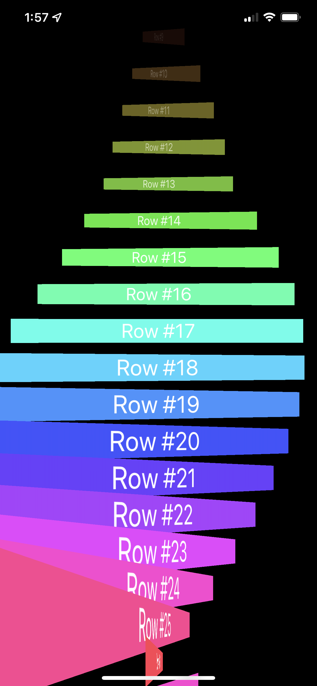
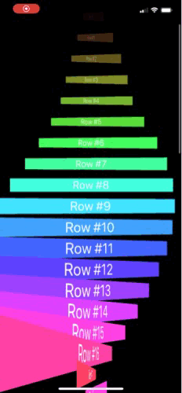

# LayoutAndGeometry
A geometry reader based animation. Day 94 challenge of 100 days of swiftUI. 

*NOTE* This gif does not do the smoothness of the animation justice, and I seem to remember the simulator having issues with it. Load it up to see how smooth all of the animation changes actually are on a phone.

  

If you are looking for help on the challenges, take a look at the code. The end state of this code was after I played around some, its not exactly what the project asked for, but it is very fun.
